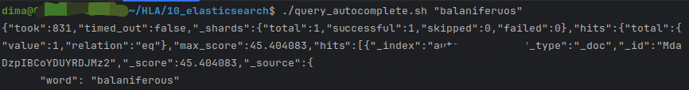
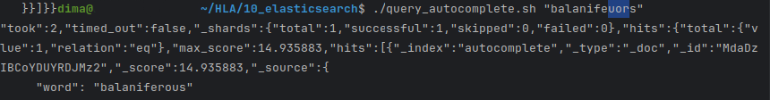

1. Спочатку ми підняли докер контейнер з еластіком
2. Далі за допомогою **setup_index.sh** ініціалізували індекс
3. Скриптиком **load_data.sh** заповнив індекс даними зі словника (**words.txt**)
4. Далі за допомогою скрипта **query_autocomplete** виконував запит на еластік і отриував автокомплітну відповідь
   згідно завдання. Для прикладу візьмемо слово 'balaniferous'. Без помилок поверне його, як і треба:  
     
   Якщо зроби хоча б менше 3 помилок, то все одно запропонує його:  
   